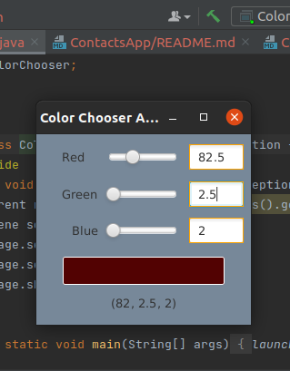
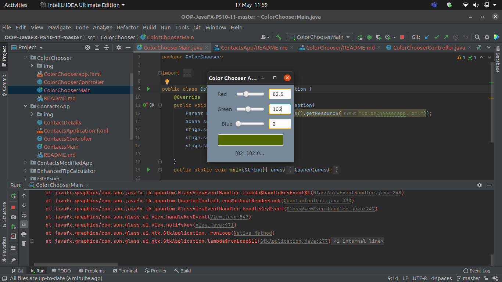
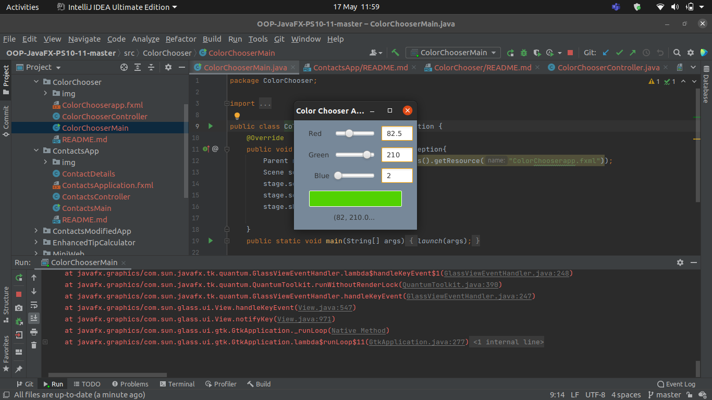

<h2> Color Chooser App </h2> 

<h3> Description </h3>
The property bindings we created in the Color Chooser app (Section 13.4 ) allowed a TextField’s text to update when a Slider’s value changed, but not vice versa. JavaFX also supports bi-directional property bindings. Research bidirectional property bindings online, then create bidirectional bindings between the Sliders and the TextFields such that modifying a TextField’s value updates the corresponding slider.
 Author: Aqeel Ahmad

<h3> App Screenshots </h3>

<h3> Software Requirements: </h3>
<h4>JavaFX SDK 11.0.2 -  https://openjfx.io/  
Scene Builder 11.0.0 - https://gluonhq.com/products/scene-builder/  
IntelliJ IDEA - https://www.jetbrains.com/idea/  
Instruction to set up - https://openjfx.io/openjfx/docs/#introduction   
For VM options: --module-path ${PATH_TO_JAVAFX} --add-modules javafx.controls,javafx.fxml ;${PATH_TO_JAVAFX} - path to JavaFX library </h4>

