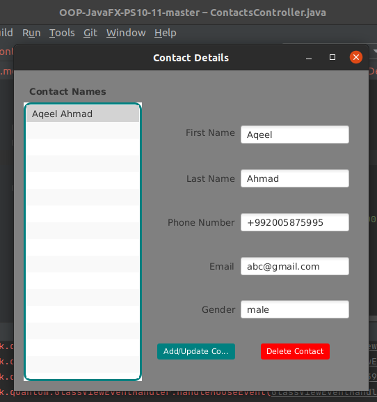
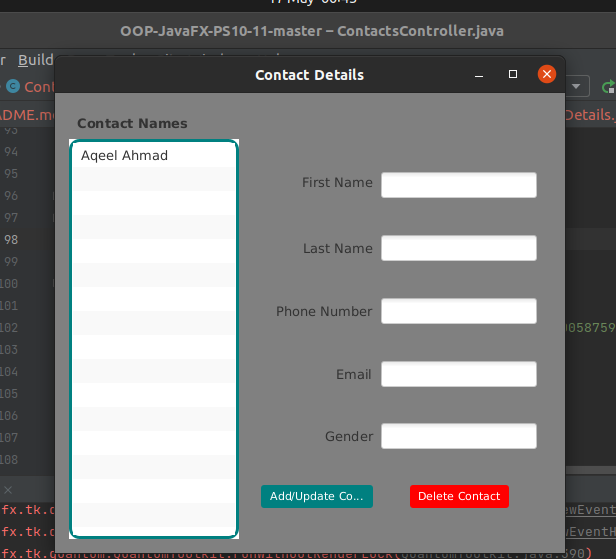

<h2> Contacts App </h2> 

<h3> Description </h3>
Create a Contacts app modeled after the Cover Viewer app (Sections 13.5 –13.6). Store the contact information in an ObservableList of Contact objects. A Contact should contain first name, last name, email and phone number properties (you can provide others). When the user selects a contact from the contacts list, its information should display in a Grid of TextFields. As the information is modified (a Contact’s data is updated, a new Contact is added or an existing Contact is deleted), the contacts ListView should display the updates. The ListView should display the Contact’s last names.
 Author: Aqeel Ahmad

<h3> App Screenshots </h3>

<h3> Software Requirements: </h3>
<h4>JavaFX SDK 11.0.2 -  https://openjfx.io/  
Scene Builder 11.0.0 - https://gluonhq.com/products/scene-builder/  
IntelliJ IDEA - https://www.jetbrains.com/idea/  
Instruction to set up - https://openjfx.io/openjfx/docs/#introduction   
For VM options: --module-path ${PATH_TO_JAVAFX} --add-modules javafx.controls,javafx.fxml ;${PATH_TO_JAVAFX} - path to JavaFX library </h4>

