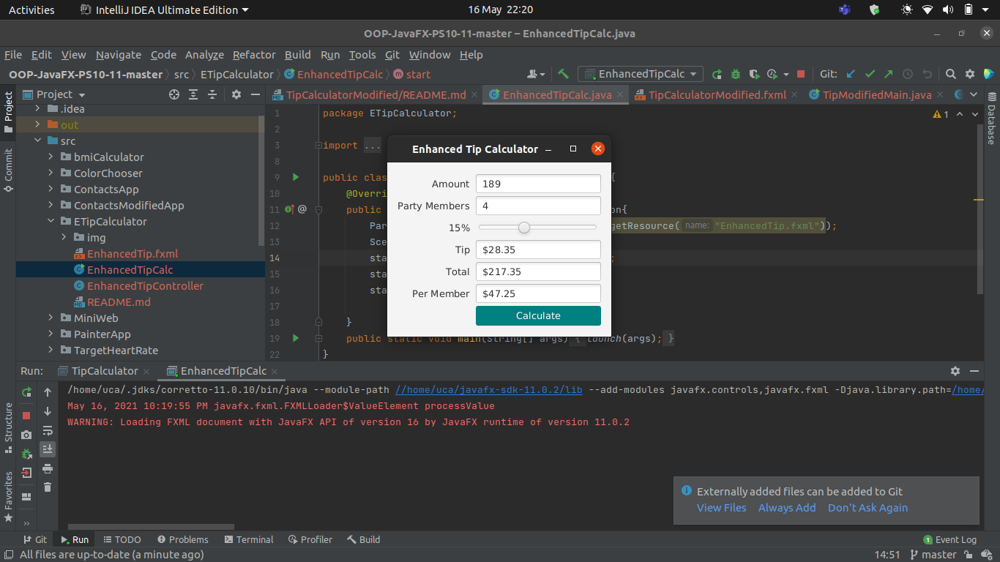

<h2> Enhanced Tip Calculator App </h2> 

<h3> Description </h3>
Modify the Tip Calculator app to allow the user to enter the number of people in the party. Calculate and display the amount owed by each person if the bill were to be split evenly among the party members.
 Author: Aqeel Ahmad

<h3> App Screenshots </h3>

#

<h3> Software Requirements: </h3>
<h4>JavaFX SDK 11.0.2 -  https://openjfx.io/  
Scene Builder 11.0.0 - https://gluonhq.com/products/scene-builder/  
IntelliJ IDEA - https://www.jetbrains.com/idea/  
Instruction to set up - https://openjfx.io/openjfx/docs/#introduction   
For VM options: --module-path ${PATH_TO_JAVAFX} --add-modules javafx.controls,javafx.fxml ;${PATH_TO_JAVAFX} - path to JavaFX library </h4>

