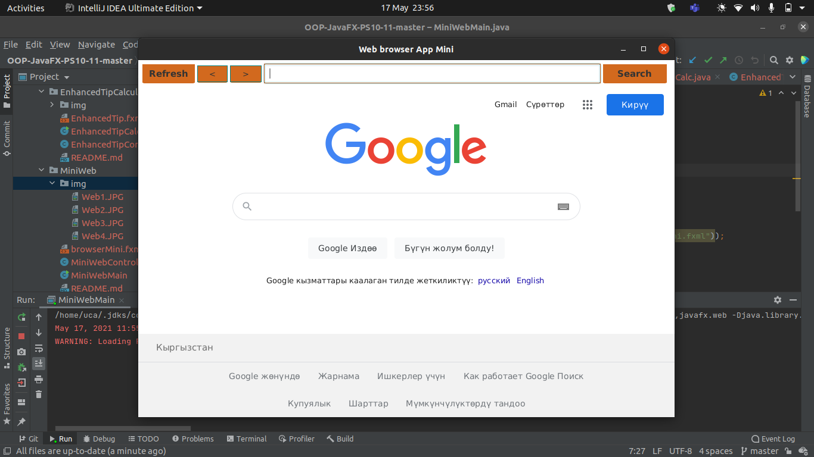
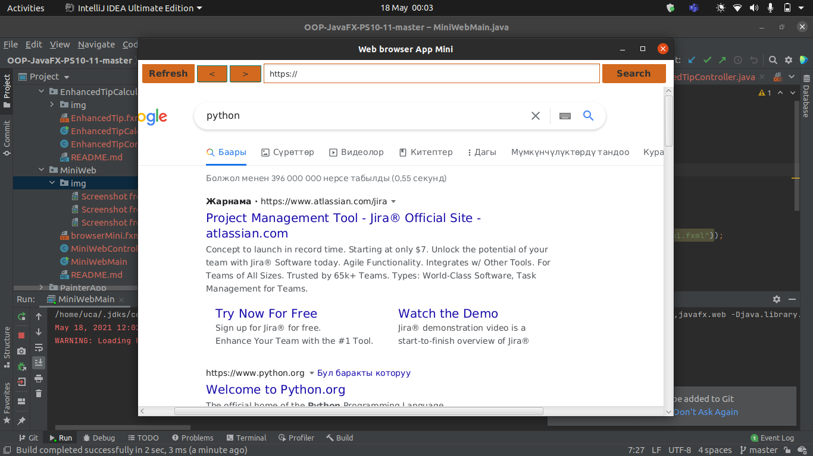
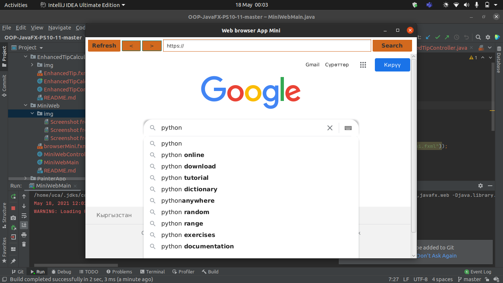
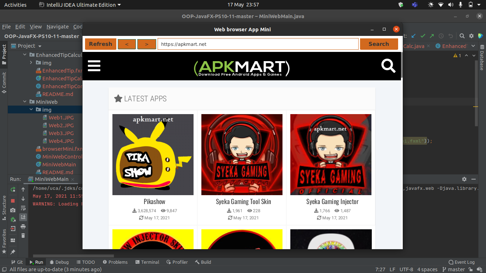

<h2> Mini Web Project </h2> 

<h3> Description </h3>
 Investigate the capabilities of JavaFX’s WebView control and WebEngine class, then create a JavaFX app that provides basic web browsing capabilities.
 Author: Aqeel Ahmad

<h3> App Screenshots </h3>

#

<h3> Software Requirements: </h3>
<h4>JavaFX SDK 11.0.2 -  https://openjfx.io/  
Scene Builder 11.0.0 - https://gluonhq.com/products/scene-builder/  
IntelliJ IDEA - https://www.jetbrains.com/idea/  
Instruction to set up - https://openjfx.io/openjfx/docs/#introduction   
For VM options: --module-path //home/uca/javafx-sdk-11.0.2/lib --add-modules javafx.controls,javafx.fxml,javafx.web </h4>

