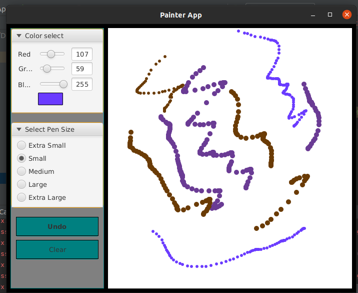
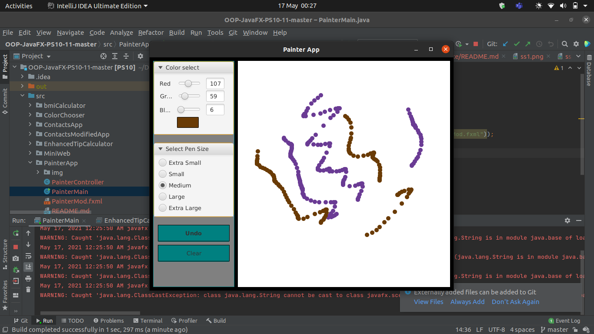

<h2> Painter App </h2> 

<h3> Description </h3>
Incorporate the RGBA color chooser you created in the Color Chooser app into the Painter app so that the user can choose any drawing color.
Changing a Slider’s value should update the color swatch displayed to the user and set the brushColor instance variable to the current Color.
 Author: Aqeel Ahmad

<h3> App Screenshots </h3>

<h3> Software Requirements: </h3>
<h4>JavaFX SDK 11.0.2 -  https://openjfx.io/  
Scene Builder 11.0.0 - https://gluonhq.com/products/scene-builder/  
IntelliJ IDEA - https://www.jetbrains.com/idea/  
Instruction to set up - https://openjfx.io/openjfx/docs/#introduction   
For VM options: --module-path ${PATH_TO_JAVAFX} --add-modules javafx.controls,javafx.fxml ;${PATH_TO_JAVAFX} - path to JavaFX library </h4>

