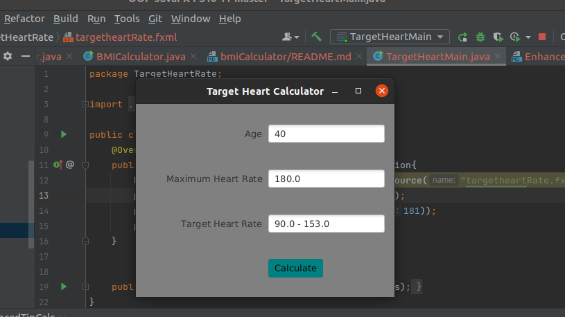
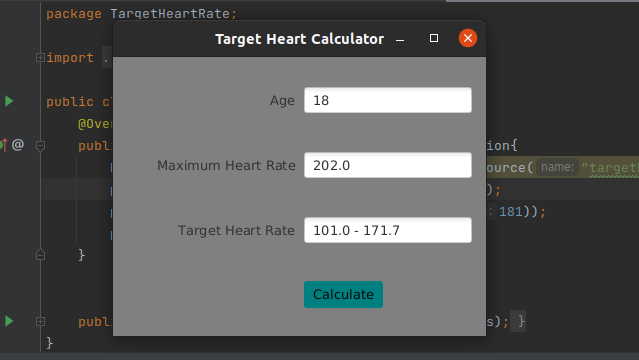

<h2> Target Heart Rate App </h2> 

<h3> Description </h3>
While exercising, you can use a heart-rate monitor to see that your heart rate stays within a safe range suggested by your trainers and doctors. 
According to the American Heart Association (AHA), the formula for calculating your maximum heart rate in beats per minute is 220 minus your age in years. Your target heart rate is a range that is 50–85% of your maximum heart rate.
 Author: Aqeel Ahmad

<h3> App Screenshots </h3>

<h3> Software Requirements: </h3>
<h4>JavaFX SDK 11.0.2 -  https://openjfx.io/  
Scene Builder 11.0.0 - https://gluonhq.com/products/scene-builder/  
IntelliJ IDEA - https://www.jetbrains.com/idea/  
Instruction to set up - https://openjfx.io/openjfx/docs/#introduction   
For VM options: --module-path ${PATH_TO_JAVAFX} --add-modules javafx.controls,javafx.fxml ;${PATH_TO_JAVAFX} - path to JavaFX library </h4>

