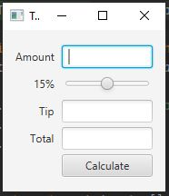

<h2> Tip Calculator App </h2> 

<h3> Description </h3>
Design and Implement the Tip Calculator app using scene builder
 
Author: Aqeel Ahmad

<h3> App Screenshots </h3>

#

JavaFX SDK 11.0.2 - https://openjfx.io/
Scene Builder 11.0.0 - https://gluonhq.com/products/scene-builder/
IntelliJ IDEA - https://www.jetbrains.com/idea/
Instruction to set up - https://openjfx.io/openjfx/docs/#introduction
For VM options: --module-path ${PATH_TO_JAVAFX} --add-modules javafx.controls,javafx.fxml ;${PATH_TO_JAVAFX} - path to JavaFX library

