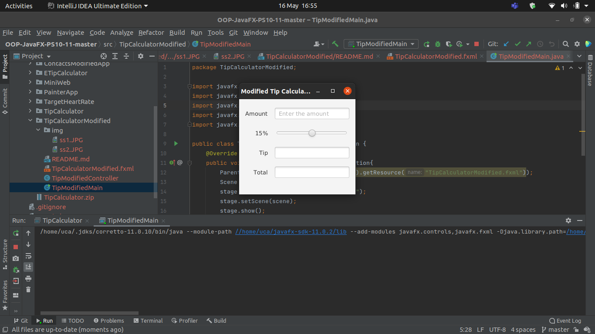

<h2> Tip Calculator App - Modified</h2> 

Author: Aqeel Ahmad

<h3> Description </h3>
The Tip Calculator app from Section 12.5 does not need a Button to perform its calculations. Re-implement this app to use property listeners to perform the calculations whenever the user modifies the bill amount or changes the custom tip percentage.
<h3> App Screenshots </h3>

#

<h3> Software Requirements: </h3>
<h4>JavaFX SDK 11.0.2 -  https://openjfx.io/  
Scene Builder 11.0.0 - https://gluonhq.com/products/scene-builder/  
IntelliJ IDEA - https://www.jetbrains.com/idea/  
Instruction to set up - https://openjfx.io/openjfx/docs/#introduction   
For VM options: --module-path ${PATH_TO_JAVAFX} --add-modules javafx.controls,javafx.fxml ;${PATH_TO_JAVAFX} - path to JavaFX library </h4>

