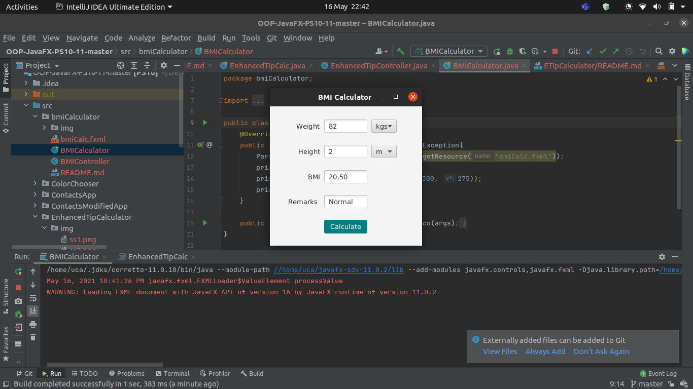

<h2> BMI Calculator App </h2> 

<h3> Description </h3>
Create a BMI calculator app that allows users to enter their weight and height and whether they are entering these values in English or metric units, then calculates and displays the user’s body mass index. The app should also display the following information from the Department of Health and Human Services/National Institutes of Health so that users can evaluate their BMIs:

 Author: Aqeel Ahmad

<h3> App Screenshots </h3>

#

<h3> Software Requirements: </h3>
<h4>JavaFX SDK 11.0.2 -  https://openjfx.io/  
Scene Builder 11.0.0 - https://gluonhq.com/products/scene-builder/  
IntelliJ IDEA - https://www.jetbrains.com/idea/  
Instruction to set up - https://openjfx.io/openjfx/docs/#introduction   
For VM options: --module-path ${PATH_TO_JAVAFX} --add-modules javafx.controls,javafx.fxml ;${PATH_TO_JAVAFX} - path to JavaFX library </h4>

